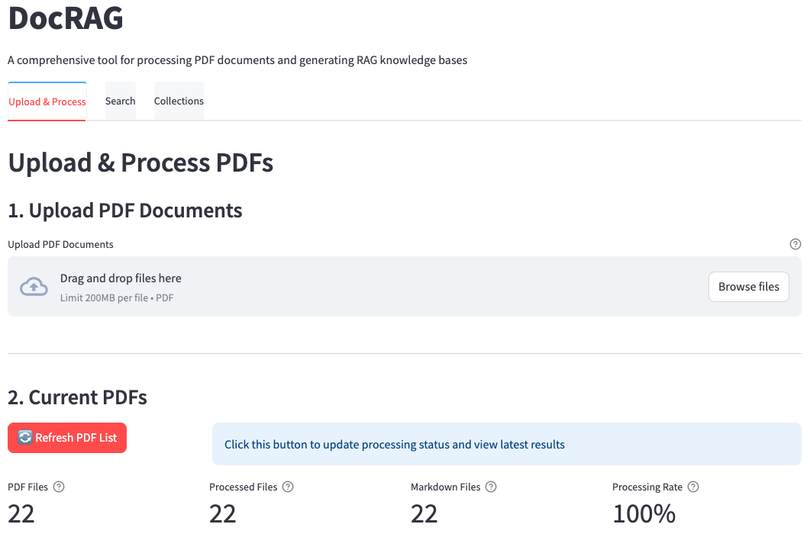

# DocRAG

[](https://www.python.org/downloads/release/python-3120/)
[](https://streamlit.io/)
[](https://opensource.org/licenses/MIT)

DocRAG is a comprehensive document processing system with RAG (Retrieval-Augmented Generation) capabilities. It allows you to upload PDF documents, extract text, create structured representations, and use them with LLM systems via a user-friendly interface.



## Features

- **PDF Processing**: Upload and process PDF documents
- **Individual Document Views**: Each document gets its own folder with TXT, JSON, and Markdown formats
- **Chunking**: Automatic text chunking for RAG applications
- **Collections**: Create and manage document collections
- **Integration**: Ready for use with Open WebUI and Ollama
- **Search**: Simple keyword search across all documents

## Getting Started

### Prerequisites

- Python 3.8 or higher (Python 3.12 recommended)
- pip (Python package manager)
- Git (for cloning the repository)

### Installation

1. Clone this repository:
   ```bash
   git clone https://github.com/jamieroszel22/Doc_RAG.git
   cd Doc_RAG
   ```

2. Install dependencies:
   ```bash
   pip install -r requirements.txt
   ```

3. Prepare the directory structure (the app will create these automatically, but you can do it manually):
   ```bash
   mkdir -p pdfs processed_docs/docs processed_docs/chunks processed_docs/ollama processed_docs/openwebui
   ```

4. Make the shell scripts executable:
   ```bash
   # Linux/macOS
   chmod +x *.sh

   # Windows (using Git Bash or WSL)
   chmod +x *.sh
   # or create .bat files calling the Python scripts directly
   ```

5. Run the application:
   ```bash
   # Linux/macOS
   ./run_streamlit.sh

   # Windows (direct Python)
   python -m streamlit run app.py
   ```

6. Open your browser at [http://localhost:8501](http://localhost:8501)

## Usage

### Uploading Documents

1. Navigate to the "Upload & Process" tab
2. Upload PDF files using the file uploader
3. Click "Save PDFs" to save the files
4. Click "Process PDFs" to extract text and create chunks

### Viewing Documents

1. Go to the "Collections" tab
2. Browse documents in the "Individual Document Collections" section
3. View or download the Markdown representation of any document

### Searching

1. Navigate to the "Search" tab
2. Enter a search query and click "Search"
3. View the matching results from across your documents

### Integration with Open WebUI

1. Process your documents in DocRAG
2. Open WebUI at http://localhost:3000
3. Go to Collections > Import Collection
4. Select the JSON file from `processed_docs/openwebui/knowledge_collection.json`

## Troubleshooting

- **Path Issues**: The app uses relative paths, so always run it from the root directory.
- **Permissions**: If shell scripts don't run, check the execution permissions (`chmod +x *.sh`)
- **Python Version**: Make sure you have Python 3.8+ installed (`python --version` or `python3 --version`)
- **Streamlit Port**: Default port is 8501. If it's in use, edit `run_streamlit.sh` to change `STREAMLIT_SERVER_PORT`

## Architecture

See the [DocRAG-TechStack.md](DocRAG-TechStack.md) file for a detailed breakdown of the system architecture and technical stack.

## Directory Structure

```
DocRAG/
├── app.py                 # Main Streamlit application
├── super_simple.py        # Core document processing engine
├── run_streamlit.sh       # Shell script to run the app
├── migrate_to_docrag.py   # Migration utility
├── requirements.txt       # Python dependencies
├── pdfs/                  # Store uploaded PDFs here
└── processed_docs/        # Processed documents
    ├── docs/              # Text, JSON and Markdown files
    ├── chunks/            # Chunked text for RAG
    ├── ollama/            # Ollama-compatible formats
    └── openwebui/         # Open WebUI collections
```

## License

This project is licensed under the MIT License - see the LICENSE file for details.

## Acknowledgments

- Originally developed as "IBM Redbooks RAG System"
- Uses [Streamlit](https://streamlit.io/) for the web interface
- PDF processing with [PyPDF2](https://pypdf2.readthedocs.io/)
